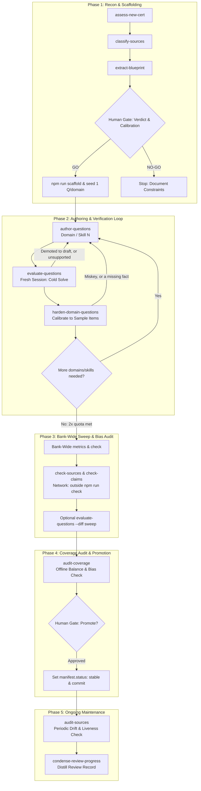

# Authoring a Certification Bank with Agent Skills

This runbook guides a human developer through steering AI agents and chaining the
workflows in [`skills/`](../skills/README.md) to create, populate, verify, and
promote a certification question bank.

## Relationship to Authoritative Specifications

- **[`certs/ADDING-A-CERT.md`](./ADDING-A-CERT.md) is the Authoritative Specification for Structure and Balance.**
  It defines schemas, required fields, mathematical balance rules, bias-guard
  thresholds, cognitive depth anchors, and CLI tool flags.
- **[`CONTRIBUTING.md`](../CONTRIBUTING.md) is the Authoritative Specification for Question Quality.**
  It defines item-writing rules, the distractor mix, the facepalm rule, the key-length
  and absolute qualifier tells, and difficulty calibration limits.
- **This document is the Human Operator Runbook.** It defines the chronological
  sequence of skills to invoke, developer prompt recipes, session-isolation
  boundaries, and human-in-the-loop decision checkpoints. It defines no rules of
  its own.

### Resuming an Existing Bank

If you are expanding or completing a bank that already exists, read its
`manifest.status` first — a `stable` bank is maintained through Phase 5, not
re-entered here. For a `draft` bank:
1. Skip Phase 1 (Reconnaissance & Scaffolding).
2. Read the historical decisions and sample inventory in `certs/<slug>/review-progress.md`.
3. Run `npm run balance -- --2x <slug>` to view remaining domain or skill deltas.
4. Jump directly to **Phase 2 (Domain/Skill Authoring & Verification Loop)**.

---

## Workflow Overview



---

## Phase 0: Prerequisites & Setup

1. **Review the Source Boundary & Content Requirements:**
   Re-read the source boundary in [`README.md`](../README.md) and the question content
   requirements in [`CONTRIBUTING.md`](../CONTRIBUTING.md). Every question must cite a
   public vendor page accessible without an account or subscription.

2. **Session Isolation Rules:**
   To guarantee question quality, enforce two distinct session boundaries:
   - **Authoring Isolation**: Author domain-by-domain (or skill-by-skill) in separate
     invocations to prevent context saturation and distractor/key cross-contamination.
   - **Evaluation Isolation**: Run [`skills/evaluate-questions`](../skills/evaluate-questions/SKILL.md)
     in a clean, independent agent session without the authoring prompt history,
     eliminating generative self-confirmation bias.

3. **Install agent skills:**
   Symlink the project skills into your agent's directory:
   ```sh
   npx skills@1.5.25 add .
   ```
   *(See [`skills/README.md`](../skills/README.md) regarding pinned versioning and telemetry.)*

4. **Check vendor profiling:**
   Read [`certs/VENDORS.md`](./VENDORS.md) to identify allowed documentation
   hosts, forbidden legacy redirects, and superseded guides for your target vendor.

---

## Phase 1: Reconnaissance & Scaffolding

Goal: Verify public documentation availability, extract blueprint weights, and
scaffold an initial, valid bank.

### 1. Invoke `assess-new-cert`

Prompt your agent:
```text
Run assess-new-cert for cert "<slug-or-name>" using exam guide <url-or-pdf-path>
```

### 2. Sub-workflows executed by the agent
The agent will automatically chain two internal reconnaissance skills:
- [`skills/classify-sources`](../skills/classify-sources/SKILL.md): Classifies
  candidate documentation on gate and authority per [`certs/ADDING-A-CERT.md`](./ADDING-A-CERT.md).
- [`skills/extract-blueprint`](../skills/extract-blueprint/SKILL.md): Derives
  exact domain weights (normalizing ranges if necessary), inventories official
  sample questions, and audits item format constraints.

### 3. Human Decision Gates (Stop-and-Ask)
The agent will stop and ask for your input on two specific checkpoints:
1. **Third-party calibration**: Confirm whether you are providing any external
   sample material solely to calibrate difficulty/style, observing the firewall
   in [`certs/ccdv-f/review-progress.md`](./ccdv-f/review-progress.md).
2. **The Verdict**:
   - **GO**: Clear public blueprint, citable documentation for all domains.
   - **GO-WITH-CONSTRAINTS**: Viable with documented limitations (e.g., thin docs in one domain).
   - **NO-GO**: Blueprint or required documentation is paywalled or gated.

### 4. Scaffolding, Registration & Seed Questions
If the guide publishes weight ranges rather than exact percentages, normalize them first using the arithmetic in [`certs/ADDING-A-CERT.md`](./ADDING-A-CERT.md):
```sh
npm run scaffold -- --normalize "<range1>,<range2>,<range3>"
```

On approval, the agent executes `npm run scaffold` to generate the file tree and register the slug in `certs/catalog.json`:
```sh
# Preview with dry-run first
npm run scaffold -- --slug <slug> --name "<Full Name>" --exam-url "<url>" --exam-questions <n> --domain "<slug>:<name>:<weight>" --register --dry-run

# Execute with --register and include --skill flags if the guide declared a skill breakdown
npm run scaffold -- --slug <slug> --name "<Full Name>" --exam-url "<url>" --exam-questions <n> --domain "<slug>:<name>:<weight>" --skill "<domain>/<skill>:<name>:<weight>" --register
```
*(Passing `--register` is critical: without it, `certs/catalog.json` is not updated and validation will fail.)*

Next:
- **The README row is not scaffolded.** `--register` writes `certs/catalog.json`
  and nothing else. The Certifications table row in [`README.md`](../README.md)
  is a separate edit required by [`certs/ADDING-A-CERT.md` § Step 1](./ADDING-A-CERT.md),
  and `test/readme-parity.test.mjs` keeps `npm run check` red until it exists
  with a status matching `manifest.json`.
- **Seed Questions**: The agent seeds one valid, fully-sourced draft question per domain so all domain files are non-empty.
- **Edits the agent may not make.** A test enumerating the real banks may
  legitimately need the new slug, but per
  [`skills/assess-new-cert`](../skills/assess-new-cert/SKILL.md) a recon must
  never edit the test suite — changing its own gate is marking its own
  homework. The agent reports the needed edit; you make it.
- **Operator Verification**: Verify that the repository is green:
  ```sh
  npm run check
  ```
  *(Tip: If `sync-dates:check` fails because timestamps differ, run `npm run sync-dates` to sync manifest dates automatically.)*

The bank now exists in `certs/<slug>/` with `manifest.status: "draft"` and is fully testable in the quiz app.

---

## Phase 2: Domain/Skill Authoring & Verification Loop

Goal: Expand question count from seed items up to the target baseline of
**2× the official exam question count** (`2 * manifest.examQuestionCount`).

### Sizing the Batches
Run the balance tool to view remaining quotas across domains and skills:
```sh
npm run balance -- --2x <slug>            # against the 2x exam baseline
npm run balance -- --target <n> <slug>    # against an interim authoring goal
```
*Batch size is governed by the balance report, not arbitrary preference.*

### The Cardinal Rule: One Domain (or Skill) per Invocation
**Never ask an agent to author an entire multi-domain bank in a single prompt.** Drafting
multiple domains simultaneously exhausts context, blends source facts, and
causes miskeys. If a domain declares a skill breakdown, author **one skill per invocation**
to ensure questions carry correct `subdomain` tags and respect skill allocations.

The rule is one domain per *invocation*, not one domain at a time. Per
[`skills/author-questions`](../skills/author-questions/SKILL.md), an
orchestrating session may fan the domains out across parallel `Agent` or
`Workflow` invocations, each still scoped to a single domain or skill. What is
forbidden is one session drafting several.

### The Authoring & Verification Loop
For each domain (or skill when declared):

1. **Author the batch (`author-questions`):**
   ```text
   Run author-questions for cert "<slug>" on domain "<domain-slug>" [skill-slug].
   Target count: <number-from-balance-report>.
   ```
   - Sourced facts first: Locate and verify public, unauthenticated vendor URLs.
   - Apply depth anchors: Conceptual discrimination over syntax recall per [`certs/ADDING-A-CERT.md`](./ADDING-A-CERT.md).
   - Update `certs/<slug>/review-progress.md` with a dated batch note.

2. **Adversarial correctness review (`evaluate-questions`):**
   *Run in a **fresh agent session** to prevent generative self-confirmation bias.*
   ```text
   Run evaluate-questions for cert "<slug>" on domain "<domain-slug>"
   ```
   - The agent solves each question **cold** using only stem, options, and cited `sourceUrl`.
   - Verified items advance to `"status": "reviewed"`. Discrepancies are fixed or demoted to `"status": "draft"`.
   - **A demotion is a work item, not a footnote.** Every item left at
     `"status": "draft"`, and every question the skill dispositions as
     `unsupported`, goes back through `author-questions` for that domain with
     its own sourcing, then back through `evaluate-questions`. Do not carry
     `draft` items forward into the Phase 4 promotion gate.

3. **Difficulty calibration (`harden-domain-questions`):**
   ```text
   Run harden-domain-questions for cert "<slug>" on domain "<domain-slug>"
   ```
   - Compares items against the official sample questions inventoried in Phase 1.
   - Tightens stems to scenarios and pads weak distractors into plausible near-misses.
   - Defaults to **no change** if the domain is already sufficiently rigorous.
   - **Routes back rather than sideways**: a key it finds contradicted is a
     miskey for `evaluate-questions`, and a domain soft because a *fact* is
     missing is `author-questions` work. Re-run the pass it names instead of
     hardening past the finding.

4. **Operator Verification:**
   Run the repository gate after each domain loop:
   ```sh
   npm run check
   ```
   *(If `sync-dates:check` fails, run `npm run sync-dates`.)*

Repeat this loop until all domains and skills satisfy their 2× baseline quota.

---

## Phase 3: Bank-Wide Sweep & Bias Audit

Once all domains and skills have reached their 2× target:

1. **Audit Bank-Wide Bias Guards:**
   Run the metrics reporter to check position skew and length balance across all domains:
   ```sh
   npm run metrics -- <slug> --markdown
   ```
   Verify that all three bank-level bias guards (answer position distribution, key length skew, and longest-key frequency) pass as defined under "Bank-level bias guards" in [`certs/ADDING-A-CERT.md` § Step 3](./ADDING-A-CERT.md).

2. **Targeted Evaluation Sweep (`--diff`):**
   If distractor padding, option rebalancing, or key edits altered any question text, run a targeted evaluation pass on the modified files:
   ```text
   Run evaluate-questions for cert "<slug>" --diff
   ```

3. **Verify the citations are live.**
   Neither task below is part of `npm run check` — both hit the network, and the
   gate has to stay offline and deterministic in CI. The consequence is that
   nothing in Phases 1 and 2 has opened a cited URL, so a bank promoted on
   `npm run check` alone would go `stable` without a single citation having been
   fetched. Close that before Phase 4:
   ```sh
   npm run check-sources -- <slug> --strict --strict-network
   npm run check-claims -- <slug>
   ```
   `check-sources` reports liveness and citation age; `check-claims` is advisory
   only and never gates — adjudicate each finding against the page yourself, per
   the caveats in Phase 5.

4. **Gate Check:**
   Confirm that `npm run check` is completely green across the repository.

---

## Phase 4: Coverage Audit & Promotion

Goal: Validate full blueprint coverage, promote the bank from `draft` to `stable`, and submit the contribution.

### 0. The two `status` fields are independent

Per [`certs/ADDING-A-CERT.md` § Bank status](./ADDING-A-CERT.md) and
[`skills/audit-coverage`](../skills/audit-coverage/SKILL.md), this repository
carries two unrelated `status` fields, and conflating them is the characteristic
error at this gate:

- `manifest.status` (`draft` | `stable`) is **coverage of the blueprint**.
- A question's own `status` (`draft` | `reviewed`) is **whether that item was reviewed**.

Neither may be derived from the other. A bank holding nothing but `reviewed`
questions can still be a `draft` bank, so Phase 2 reaching `reviewed` across
every domain is not itself a promotion signal. Nor is question count: there is
**no mechanical threshold** for `draft` → `stable` — not a count, not a share,
not a ratio — and that absence is deliberate. Any number offered as the bar was
invented.

### 1. Invoke `audit-coverage`
Run the coverage audit:
```text
Run audit-coverage for cert "<slug>"
```
The agent executes offline checks:
```sh
npm run validate
npm run balance -- --strict
npm run metrics -- <slug> --markdown
```

### 2. Human Promotion Gate
`manifest.status` promotion is **always human-gated**:
- The agent outputs a per-domain coverage table and an explicit recommendation to promote or hold.
- The agent is **prohibited from flipping `manifest.status` unasked**.
- **Do not re-flag the recorded non-defects.** Two standing decisions read as
  failures to anyone seeing the table cold: the per-skill floor deliberately
  over-provisions the smallest domains, so the thinnest skills sit above their
  weights; and ccdv-f's difficulty headroom above its sample anchor is intent —
  its review file says not to fix it. Read
  [`skills/audit-coverage`](../skills/audit-coverage/SKILL.md) stage 4 before
  treating either as a coverage finding.
- If you approve:
  1. Authorize the agent to update `manifest.json`: set `"status": "stable"`.
  2. Record the promotion rationale in `certs/<slug>/review-progress.md`.
  3. Confirm that `npm run check` passes. *(Note: per [`AGENTS.md`](../AGENTS.md), `npm run build` is only required if you touched `src/`).*

### 3. Landing the Bank & Pull Request
Per [`certs/ADDING-A-CERT.md`](./ADDING-A-CERT.md) and [`CONTRIBUTING.md § Pull requests`](../CONTRIBUTING.md):
- **Atomic commit**: The `manifest.status` change to `"stable"` and the `review-progress.md` rationale must be committed together in the same commit.
- **Content licensing**: Submitting questions implies agreement that original question content in `questions/*.json` is licensed under **CC BY-SA 4.0** (manifests and code are MIT).
- **PR hygiene**: Keep changes focused, confirm that `npm run check` is green, and verify that no build artifacts, secrets, or manual edits to `package-lock.json` are included.

---

## Phase 5: Ongoing Maintenance (`audit-sources`)

Over time, vendor documentation moves, redirects, or updates.

`check-sources` flags a citation as stale at `--max-age-days`, which defaults to
180 days — a roughly six-month sweep keeps a bank clear of its own default.
Run one sooner whenever a vendor announces a guide revision or a link is
reported broken.

Invoke [`skills/audit-sources`](../skills/audit-sources/SKILL.md):
```text
Run audit-sources for cert "<slug>"
```

### Triage Tools & Caveats
`audit-sources` automatically runs `npm run check-sources` and `npm run check-claims` as the mechanical-triage stage (Stage 2) of its pass:
- `npm run check-sources` verifies URL liveness and reports citation age against `--max-age-days`.
- `npm run check-claims` is **advisory only** ([`CONTRIBUTING.md § Validate content changes`](../CONTRIBUTING.md)):
  - It checks quotes, identifiers, and figures against pages served from `.md`-capable documentation hosts.
  - Its signal-to-noise ratio is poor — [`certs/ADDING-A-CERT.md` § Supporting npm tasks](./ADDING-A-CERT.md)
    states the expected rate — so adjudicate every finding against the page
    yourself, and never interpret a quiet run as proof that claims are accurate.
  - Citations on other hosts return `inconclusive: out-of-scope host`, which is not a clean pass.

The skill resolves broken URLs, re-dates verified citations, updates [`certs/VENDORS.md`](./VENDORS.md), and detects blueprint revisions.

### Review Record Hygiene (`condense-review-progress`)

After completing a major batch expansion, bank promotion, or source drift pass, `review-progress.md` often accumulates bloated drafting narratives or extensive clean-pass item listings.

Invoke [`skills/condense-review-progress`](../skills/condense-review-progress/SKILL.md):
```text
Run condense-review-progress for cert "<slug>"
```

The agent audits the review record against permanent invariants (sample questions, deliberate non-defects, architectural rulings) and condenses repetitive tables and narrative prose down to a clean, readable standing record.

---

## Quick Reference: Skill Sequencing

| Phase | Skill | Primary Inputs / Tools | Next Handoff |
|---|---|---|---|
| **1. Recon** | [`assess-new-cert`](../skills/assess-new-cert/SKILL.md) | Exam guide URL; `npm run scaffold` | `author-questions` (Domain/Skill 1) |
| **2. Author** | [`author-questions`](../skills/author-questions/SKILL.md) | Domain/skill slug; `npm run balance -- --2x` | `evaluate-questions` (Domain/Skill N) |
| **2. Verify** | [`evaluate-questions`](../skills/evaluate-questions/SKILL.md) | Domain/skill slug; cold source fetch | `harden-domain-questions` (Domain/Skill N) |
| **2. Calibrate** | [`harden-domain-questions`](../skills/harden-domain-questions/SKILL.md) | Domain slug; sample inventory | Next domain/skill (or Phase 3 sweep) |
| **3. Sweep** | [`evaluate-questions`](../skills/evaluate-questions/SKILL.md) | `--diff` or full slug; `npm run metrics`; `npm run check-sources` / `check-claims` | `audit-coverage` |
| **4. Promote** | [`audit-coverage`](../skills/audit-coverage/SKILL.md) | `npm run metrics`; balance check | **Human developer** |
| **5. Maintain** | [`audit-sources`](../skills/audit-sources/SKILL.md) | Full bank or host | `condense-review-progress` (or ongoing) |
| **5. Hygiene** | [`condense-review-progress`](../skills/condense-review-progress/SKILL.md) | `certs/<slug>/review-progress.md` | Clean standing review record |

> [!NOTE]
> **Question Types Outside Single/Multi Select:**
> The repository explicitly restricts bank content to single-select and multi-response questions. Introducing any new answer shape (e.g. drag-and-drop, ordering) requires app, schema, and storage migrations. If a new shape is ever considered, follow the hazard gate in [`skills/add-question-type`](../skills/add-question-type/SKILL.md) and [`certs/ADDING-A-QUESTION-TYPE.md`](./ADDING-A-QUESTION-TYPE.md).
