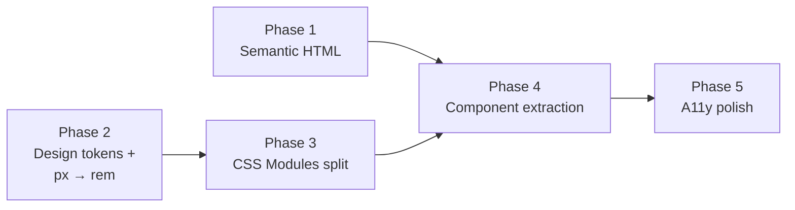

# Frontend Refactoring & Accessibility Plan

> Decisions locked: CSS Modules for scoping · ~5 components from QuizSessionPage · No dark mode

---

## Current state summary

| File                                                                                         | Lines | Role                                                  |
| -------------------------------------------------------------------------------------------- | ----: | ----------------------------------------------------- |
| [index.css](file:///Users/eero/Nitor/cert-prep-open/src/index.css)                           | 1 030 | Single global stylesheet for entire app               |
| [QuizSessionPage.tsx](file:///Users/eero/Nitor/cert-prep-open/src/pages/QuizSessionPage.tsx) | 1 138 | Setup form + active quiz session + all question logic |
| [ResultsPage.tsx](file:///Users/eero/Nitor/cert-prep-open/src/pages/ResultsPage.tsx)         |   262 | Score summary + review list                           |
| [CertPickerPage.tsx](file:///Users/eero/Nitor/cert-prep-open/src/pages/CertPickerPage.tsx)   |    67 | Home / cert picker                                    |
| [App.tsx](file:///Users/eero/Nitor/cert-prep-open/src/App.tsx)                               |    53 | Router shell + header/footer                          |
| [PageStatus.tsx](file:///Users/eero/Nitor/cert-prep-open/src/components/PageStatus.tsx)      |    37 | Loading & error states                                |

---

## Execution Order



**Recommended order**: 1 → 2 → 3 → 4 → 5

Each phase is a separate branch/PR. Every phase must pass `npm run check` before merge.

---

## Phase 1 — Semantic HTML · `STATUS: COMPLETED`

**Goal**: Fix the document semantics so screen readers and assistive tech get correct structure.

**Estimated effort**: 2–3 hours

### 1.1 Question stem: `<h2>` → visible `<legend>`

**Current** ([QuizSessionPage.tsx:1001](file:///Users/eero/Nitor/cert-prep-open/src/pages/QuizSessionPage.tsx#L1001)):

```tsx
<h2 id={questionHeadingId}>{question.stem}</h2>
...
<fieldset className="answer-option-list" aria-label="Answer options">
  <legend className="sr-only">Answer options</legend>
```

**Problem**: The question stem is an `<h2>` _outside_ the `<fieldset>`. Screen readers announce the generic "Answer options" legend rather than the actual question text when entering the group. The `<h2>` also creates a misleading document outline — each question looks like a new section heading.

**Fix**: Make the question stem the **visible `<legend>`** of the answer `<fieldset>`. Remove the redundant `aria-label` and sr-only legend. The instruction paragraph stays as `aria-describedby`.

```tsx
<fieldset
  className="answer-option-list"
  aria-describedby={questionInstructionId}
>
  <legend className="question-stem">{question.stem}</legend>
  ...
</fieldset>
```

### 1.2 Answer option labels: remove redundant id/htmlFor

**Current** ([QuizSessionPage.tsx:1022-1046](file:///Users/eero/Nitor/cert-prep-open/src/pages/QuizSessionPage.tsx#L1022-L1046)):

```tsx
<label className="answer-option" htmlFor={`${question.id}-${option.id}`}>
  <input id={...} type="radio" ... />
  <span className="option-id">A</span>
```

**Problem**: Wrapping `<label>` + explicit `htmlFor` is redundant and can cause double-announcement in some AT. The option-id badge ("A", "B") is decorative.

**Fix**: Keep wrapping `<label>`, remove `htmlFor`/`id` pair, add `aria-hidden="true"` to option-id badge.

### 1.3 Review card options: add semantic grouping

**Current** ([ResultsPage.tsx:37-58](file:///Users/eero/Nitor/cert-prep-open/src/pages/ResultsPage.tsx#L37-L58)): Review options are plain `<div>`s with no grouping.

**Fix**: Wrap in `<ul role="list">` with `<li>` per option. These are read-only, so no form controls needed.

### 1.4 Results stats: `<div>` → `<dl>`

**Current** ([ResultsPage.tsx:150-192](file:///Users/eero/Nitor/cert-prep-open/src/pages/ResultsPage.tsx#L150-L192)): Label/value pairs in generic `<div>`s.

**Fix**: Use description list:

```tsx
<dl className="results-grid">
  <div>
    <dt className="results-label">Score</dt>
    <dd className="results-value">85%</dd>
    <dd className="results-detail">17 correct</dd>
  </div>
</dl>
```

### 1.5 Skip link: move before header

**Current** ([App.tsx:19-21](file:///Users/eero/Nitor/cert-prep-open/src/App.tsx#L19-L21)): Skip link is _after_ the header in DOM.

**Fix**: Move to first child of `.app-shell`, before `<header>`.

### 1.6 Setup card: `<article>` → `<div>`

**Current** ([QuizSessionPage.tsx:555](file:///Users/eero/Nitor/cert-prep-open/src/pages/QuizSessionPage.tsx#L555)): Setup form uses `<article>`, but it's not self-contained content.

**Fix**: Change to `<div>` or `<section>`.

### Acceptance criteria

- [x] VoiceOver reads question stem as the fieldset label when navigating answers
- [x] No duplicate announcements on answer options
- [x] Skip link is first focusable element
- [x] Results stats are announced as term/definition pairs
- [x] `npm run check` passes

---

## Phase 2 — Design Tokens & px → rem · `STATUS: COMPLETED`

**Goal**: Extract hardcoded values into CSS custom properties and convert `px` to `rem` with a clear policy.

**Estimated effort**: 2–3 hours

### 2.1 Create `src/styles/tokens.css`

Extract all repeated colors, spacing, and radii into CSS custom properties:

```css
:root {
  /* Brand */
  --color-primary: #5465d8;
  --color-primary-hover: #4050bf;
  --color-primary-light: #eef0ff;
  --color-primary-text: #4655bb;

  /* Neutrals */
  --color-text: #172033;
  --color-text-heading: #101828;
  --color-text-secondary: #667085;
  --color-text-tertiary: #475467;
  --color-border: #e3e8f1;
  --color-border-input: #d0d5dd;
  --color-bg: #f5f7fb;
  --color-bg-card: #ffffff;
  --color-bg-muted: #f8f9fc;

  /* Feedback */
  --color-success: #75c78b;
  --color-success-bg: #f0fbf3;
  --color-error: #f49b9b;
  --color-error-bg: #fff5f5;
  --color-warning-border: #f2c94c;
  --color-warning-bg: #fffaf0;

  /* Spacing scale */
  --space-xs: 0.25rem;
  --space-sm: 0.5rem;
  --space-md: 1rem;
  --space-lg: 1.5rem;
  --space-xl: 2rem;
  --space-2xl: 3rem;

  /* Radii */
  --radius-sm: 0.5rem;
  --radius-md: 0.625rem;
  --radius-lg: 0.75rem;
  --radius-xl: 1.25rem;
  --radius-pill: 999px;

  /* Focus ring */
  --focus-ring: 3px solid rgba(84, 101, 216, 0.45);
  --focus-ring-offset: 0.1875rem;
}
```

### 2.2 px → rem conversion policy

| Use case                            | Unit        | Rationale                                          |
| ----------------------------------- | ----------- | -------------------------------------------------- |
| Font sizes                          | `rem`       | Respects user's browser font-size preference       |
| Spacing (margin, padding, gap)      | `rem`       | Scales with user preference                        |
| Max-widths, breakpoints             | `rem`       | Scales with user preference                        |
| `min-height` on interactive targets | `rem`       | 44px → 2.75rem, scales with user text size         |
| Border-radius                       | `rem`       | Scales proportionally                              |
| **Border widths**                   | **`px`** ✅ | Borders stay consistent — a 1px line is a 1px line |
| **Box shadows**                     | **`px`** ✅ | Visual embellishment, not content                  |
| **Outline widths**                  | **`px`** ✅ | Focus ring thickness is a UX constant              |

### 2.3 Media query breakpoints

| Current            | Converted             |
| ------------------ | --------------------- |
| `max-width: 640px` | `max-width: 40rem`    |
| `max-width: 900px` | `max-width: 56.25rem` |

### 2.4 Apply tokens + rem throughout `index.css`

Replace all hardcoded hex colors with `var(--color-*)` and convert `px` values per the policy above. ~160 occurrences.

### Acceptance criteria

- [x] No hardcoded hex colors remain in CSS (all use custom properties)
- [x] Only border, shadow, and outline use `px` — everything else is `rem`
- [x] Media queries use `rem`
- [x] Visual appearance is identical (screenshot comparison)
- [x] `npm run check` passes

---

## Phase 3 — CSS Modules Split · `STATUS: COMPLETED`

**Goal**: Break the 1030-line monolithic `index.css` into co-located CSS Modules for each component/page.

**Estimated effort**: 3–4 hours

### 3.1 Target file structure

```
src/
  index.css                       ← Resets, tokens import, typography, global focus (~80 lines)
  styles/
    tokens.css                    ← (from Phase 2)
    layout.css                    ← .app-shell, .content-width, header, footer
    buttons.css                   ← .button, .button-primary, .button-secondary, .text-link
  components/
    PageStatus.module.css
    PageStatus.tsx
  pages/
    CertPickerPage.module.css
    CertPickerPage.tsx
    QuizSessionPage.module.css
    QuizSessionPage.tsx
    ResultsPage.module.css
    ResultsPage.tsx
```

### 3.2 Extraction mapping

| Step | What moves                                                                               | Current lines (approx)    | Destination                  |
| ---- | ---------------------------------------------------------------------------------------- | ------------------------- | ---------------------------- |
| 1    | Resets, body, typography                                                                 | 1–48, 134–161             | keep in `index.css`          |
| 2    | Layout shell, header, footer                                                             | 50–106, 909–920           | `layout.css`                 |
| 3    | Buttons, text links                                                                      | 406–458                   | `buttons.css`                |
| 4    | State cards (loading, error)                                                             | 709–737, 894–901, 922–937 | `PageStatus.module.css`      |
| 5    | Cert grid, cert card, domain list                                                        | 163–404                   | `CertPickerPage.module.css`  |
| 6    | Setup form, tabs, question card, progress, timer, answer options, feedback, quiz actions | 188–349, 460–708          | `QuizSessionPage.module.css` |
| 7    | Results grid, domain breakdown, review cards                                             | 739–901                   | `ResultsPage.module.css`     |
| 8    | Responsive overrides                                                                     | 749–1018                  | Distribute into each module  |
| 9    | Reduced motion, global focus                                                             | 934–1029                  | keep in `index.css`          |

### 3.3 Shared styles strategy

Styles used across multiple components (`.button`, `.eyebrow`, `.content-width`) stay as **global plain CSS** imported in `index.css` or `main.tsx`. Component-specific styles become CSS Modules with locally-scoped class names.

### Acceptance criteria

- [x] `index.css` is ≤ 100 lines (resets, token imports, typography, global focus, reduced motion)
- [x] Each page/component has a co-located `.module.css` file
- [x] No broken styles — visual appearance identical
- [x] Shared utility classes (buttons, layout) are still globally available
- [x] `npm run check` passes

---

## Phase 4 — Component Extraction · `STATUS: PENDING`

**Goal**: Break [QuizSessionPage.tsx](file:///Users/eero/Nitor/cert-prep-open/src/pages/QuizSessionPage.tsx) (1 138 lines) into ~5 focused components.

**Estimated effort**: 3–4 hours

### 4.1 Target component tree

```
QuizSessionPage (~300 lines — state owner, routing)
├── QuizSetupForm          (~200 lines)
│   ├── QuestionSetFieldset (inline, shared between tabs)
│   └── SimulationForm (tab panel)
├── QuizProgress           (~50 lines)
│   └── TimerBadge (inline)
├── QuizQuestion           (~180 lines)
│   ├── QuestionHeader (meta badges + bookmark button)
│   ├── AnswerOptionList (fieldset + options)
│   └── AnswerFeedback (explanation panel)
└── QuizActions            (~40 lines — prev/next/finish)
```

### 4.2 State management

All state stays in `QuizSessionPage` and flows down via props. No context or external state library needed — these are purely presentational extractions.

### 4.3 File structure after extraction

```
src/components/
  PageStatus.tsx + .module.css
  QuizSetupForm.tsx + .module.css      ← NEW
  QuizQuestion.tsx + .module.css       ← NEW
  QuizProgress.tsx + .module.css       ← NEW
  QuizActions.tsx + .module.css        ← NEW
```

### Acceptance criteria

- [ ] `QuizSessionPage.tsx` is ≤ 350 lines
- [ ] Each new component has clear props interface
- [ ] All existing behavior preserved (test manually: setup → quiz → finish → results)
- [ ] CSS Modules co-located with each new component
- [ ] `npm run check` passes

---

## Phase 5 — Accessibility Polish · `STATUS: PENDING`

**Goal**: Fix remaining a11y issues found during audit.

**Estimated effort**: 1–2 hours

### 5.1 Color contrast fixes

| Element                         | Foreground | Background | Ratio  | Issue                           |
| ------------------------------- | ---------- | ---------- | ------ | ------------------------------- |
| `.eyebrow` (12px text)          | `#5465d8`  | `#f5f7fb`  | 4.22:1 | Needs 4.5:1 for AA at this size |
| `.results-detail` (0.8rem text) | `#667085`  | `#f8f9fc`  | 4.28:1 | Needs 4.5:1 for AA at this size |

**Fix**: Darken `--color-primary` slightly for small text uses, or increase the font size to ≥ 18px/14px bold (where 3:1 suffices).

### 5.2 Focus management on question navigation

**Current**: When clicking "Next question", focus stays on the button. Keyboard users are stranded.

**Fix**: Add a ref on the question `<fieldset>` and call `.focus()` in a `useEffect` keyed on `questionIndex`. This moves focus to the new question automatically.

### 5.3 Form error association

**Current**: `<p className="form-error" role="alert">` near the submit button, not associated with specific fields.

**Fix**: For form-level errors the `role="alert"` pattern is sufficient (AT announces immediately). Optionally add `aria-describedby` on the submit button pointing at the error for context.

### Acceptance criteria

- [ ] Eyebrow and results-detail text pass WCAG AA contrast (≥ 4.5:1)
- [ ] Focus moves to question content on Next/Previous navigation
- [ ] VoiceOver full walkthrough: home → pick cert → setup → answer 2 questions → finish → results — no dead ends or missing announcements
- [ ] `npm run check` passes

---

## Summary

| Phase     | Scope                    | Effort      | Status      |
| --------- | ------------------------ | ----------- | ----------- |
| 1         | Semantic HTML            | 2–3 h       | `COMPLETED` |
| 2         | Design tokens + px → rem | 2–3 h       | `COMPLETED` |
| 3         | CSS Modules split        | 3–4 h       | `COMPLETED` |
| 4         | Component extraction     | 3–4 h       | `PENDING`   |
| 5         | Accessibility polish     | 1–2 h       | `PENDING`   |
| **Total** |                          | **11–16 h** |             |
